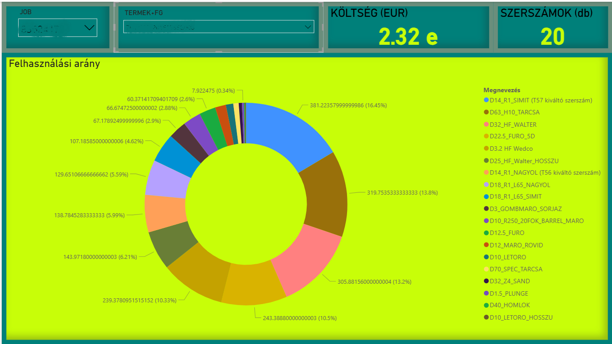
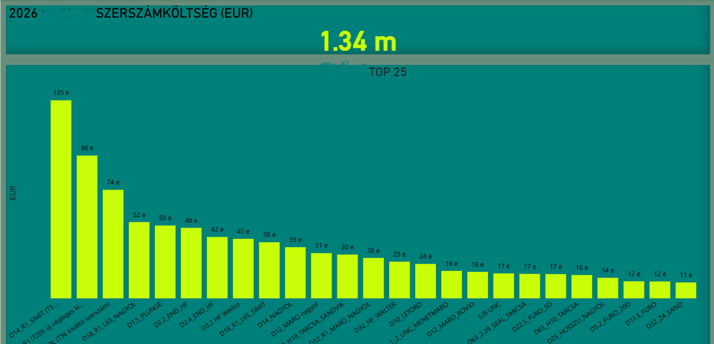
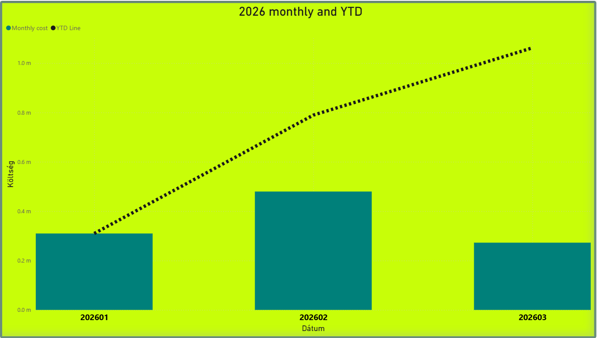

# CNC-Tool-Analysis
CNC machine tool cost analysis pipeline

# CNC Tool Cost Analysis Pipeline

End-to-end data pipeline for CNC machine tool cost analysis.  
Automated data collection → cleaning → modelling → visualization.

 ## Key Achievements
 
- **Excluded UI lag (~3s)** from cycle time measurements for accurate data
- **Optimized logging logic** – tool registration happens after each tool call
  instead of start/end of main program only
  - Result: reduced operator data manipulation possibilities
- **~1 hour saved every 2 days** through cycle time improvements
  identified by the system (based on high tool change frequency analysis)

## Technologies Used

- **PowerShell** – automated log collection and file management
- **Excel Power Query (M)** – ETL pipeline
- **Power BI** – visualization and dashboards
- **Windows Task Scheduler** – full automation
- **Heidenhain Klartext** – CNC program files (.H, .A, .TAB, .txt)
  - Source data extraction from CNC machine logs

## Pipeline Overview

## 1. Data Collection (PowerShell)
- Automatic download and extraction of CNC machine log files (ZIP)
- Organized into unified folder structure
- Runs daily without manual intervention

## 2. ETL – Power Query
  - Reading raw text log files
  - Parsing rows and columns
  - Setting data types
  - Filtering invalid data
  - Calculated fields (e.g. cutting ratio, datetime)
  - Two views:
  - **Operational** – last ~2000 rows for daily analysis
  - **Strategic** – full year for cost analysis

## 3. Data Model
  - Separate fact and aggregated tables
  - **Operational dataset** – current data (1 month)
  - **Annual dataset** – full year cost analysis

## 4. Visualization (Power BI)
  - KPI cards (tool cost, tool count, machine utilization)
  - Pareto chart / tool cost breakdown (donut, waterfall)
  - Monthly trend and cumulative YTD cost
  - Dynamic filtering (job, product)

## 5. Automation
  - Daily log download (night)
  - Morning data refresh + save
  - Zero manual intervention required

## 6. Version Control
  - Git – full history of pipeline development

## 7. Python Automation
  - `refresh_helper.py` – automated Excel refresh via win32com
  - `koltseg_szamolo.py` – tool cost calculator per setup
  - `config.py` – centralized path management, multi-machine compatible
  - Box cloud sync detection before refresh
  - Formatted Excel output with openpyxl

## Use Cases
  - Tool cost analysis per setup
  - Identifying problematic tools
  - Operator error detection
  - Performance improvement tracking
  - Cycle time improvement analysis
  - Operator utilization monitoring
  - Cutting ratio analysis (program efficiency)

## Architecture
CNC Machines → PowerShell (ZIP extract) → Folder structure
                                                ↓
                                    Power Query ETL (M language)
                                                ↓
                              ┌─────────────────────────────┐
                              │         Data Model          │
                              │  Fact tables + Aggregations │
                              └─────────────────────────────┘
                                                ↓
                              ┌──────────────┬─────────────┬─────────────┐
                              │   Power BI   │   Python    │  Python     |
                              │  Dashboards  │  Cost calc  │ Muveletek   |
                              └──────────────┴─────────────┴─────────────┘

## Dashboard Screenshots

### Setup Cost Analysis

### Annual Tool Cost - Top 25

### Monthly and YTD Trend

## Project Status
✅ Active – running in production environment
